# WEATHER APP

_***WeatherApp is a responsive weather dashboard built with React and TypeScript.***_

It consumes real-time weather data from the [WeatherAPI](https://www.weatherapi.com/) and dynamically adapts its layout for mobile, tablet, and desktop devices.
</br>The project focuses on modular architecture, reusable components, custom hooks, and scalable folder structure.


&nbsp;&nbsp;&nbsp;&nbsp;
[](https://github.com/ismaelmarot/WeatherApp/blob/HEAD/LICENSE)
&nbsp;&nbsp;&nbsp;&nbsp;

[](https://github.com/ismaelmarot/WeatherApp/commit/main)
&nbsp;&nbsp;&nbsp;&nbsp;

&nbsp;&nbsp;&nbsp;&nbsp;
<a href="https://github.com/ismaelmarot/WeatherApp" target="_blank">
  
</a>
&nbsp;&nbsp;&nbsp;&nbsp;
<a href="https://github.com/ismaelmarot/WeatherApp/network/members" target="_blank">
  
</a>

 
 
 


<br>

<p  align="center">
  <a href="https://ismaelmarot.github.io/WeatherApp/" target="_blank">
    
  </a>
</p>

<br>

------------------------------------------------------------------------------------------------------------------------------------------------


## What It Does?
  - Fetches current conditions, forecasts, and air quality data from an external weather API
  - Resolves a user's location via the browser Geolocation API or a city-name search
  - Displays data across a set of scroll-snap screens covering temperature, wind, rain, UV index, humidity, air quality, pressure, and lunar phases
  - Adapts its layout to mobile, tablet, and desktop viewports
  - Is structured as a Progressive Web App (PWA) with mobile-safe-area and fullscreen meta tags in index.html

> [!CAUTION]
> <sub>_Do not use in production (Experimental features)._</sub>

<br>

------------------------------------------------------------------------------------------------------------------------------------------------

## 📑 [TABLE OF CONTENT](#-table-of-content)

1. [Highlights](#highlights)
2. [Technologies Stack](#technologies)
3. [Codebase Layer Map](#codebaser-layer-map)
4. [Installation](#installation)
5. [Project Structure](#project-structure)
6. [Key Module Relationships](#key-module-relationships)
6. [Usage](#usage)
7. [Testing](#testing)
8. [Version](#version)
9. [Screenshots](#screenshots)
10. [Live Demo](#live-demo)

<br>

------------------------------------------------------------------------------------------------------------------------------------------------

<a id="highlights"></a>
## 🌟 [HIGHLIGHTS](#-table-of-content)

- Modular architecture with reusable components, hooks, and constants  
- Responsive layout for mobile, tablet, and desktop  
- Scroll-snap screens for temperature, wind, humidity, UV, air quality, and moon phases  
- Lazy loading and Suspense for performance optimization  
- Fully typed with TypeScript for reliability and maintainability  
- Unit-tested with Vitest and React Testing Library  

<br>

------------------------------------------------------------------------------------------------------------------------------------------------

<a id="technologies"></a>
## 🛠️ [TECNOLOGIES STACK](#-table-of-content)
 
<table style="border-collapse: collapse; width: 100%;">
  <tr>
    <th style="border-bottom: 2px solid #ccc; text-align:left; padding:8px;">Category</th>
    <th style="border-bottom: 2px solid #ccc; text-align:left; padding:8px;">Library / Tool</th>
    <th style="border-bottom: 2px solid #ccc; text-align:left; padding:8px;">Version</th>
  </tr>

  <tr>
    <td style="border-bottom: 1px solid #eee; padding:8px;">UI framework</td>
    <td style="border-bottom: 1px solid #eee; padding:8px;">React</td>
    <td style="border-bottom: 1px solid #eee; padding:8px;">^19.2.0</td>
  </tr>

  <tr>
    <td style="border-bottom: 1px solid #eee; padding:8px;">Language</td>
    <td style="border-bottom: 1px solid #eee; padding:8px;">TypeScript</td>
    <td style="border-bottom: 1px solid #eee; padding:8px;">~5.9.3</td>
  </tr>

  <tr>
    <td style="border-bottom: 1px solid #eee; padding:8px;">Build tool</td>
    <td style="border-bottom: 1px solid #eee; padding:8px;">Vite + @vitejs/plugin-react</td>
    <td style="border-bottom: 1px solid #eee; padding:8px;">^7.2.4 / ^5.1.1</td>
  </tr>

  <tr>
    <td style="border-bottom: 1px solid #eee; padding:8px;">CSS-in-JS</td>
    <td style="border-bottom: 1px solid #eee; padding:8px;">styled-components</td>
    <td style="border-bottom: 1px solid #eee; padding:8px;">^6.3.8</td>
  </tr>

  <tr>
    <td style="border-bottom: 1px solid #eee; padding:8px;">Charting</td>
    <td style="border-bottom: 1px solid #eee; padding:8px;">recharts</td>
    <td style="border-bottom: 1px solid #eee; padding:8px;">^3.7.0</td>
  </tr>

  <tr>
    <td style="border-bottom: 1px solid #eee; padding:8px;">Weather icons</td>
    <td style="border-bottom: 1px solid #eee; padding:8px;">weather-icons</td>
    <td style="border-bottom: 1px solid #eee; padding:8px;">^1.3.2</td>
  </tr>

  <tr>
    <td style="border-bottom: 1px solid #eee; padding:8px;">General icons</td>
    <td style="border-bottom: 1px solid #eee; padding:8px;">react-icons</td>
    <td style="border-bottom: 1px solid #eee; padding:8px;">^5.5.0</td>
  </tr>

  <tr>
    <td style="border-bottom: 1px solid #eee; padding:8px;">Date utilities</td>
    <td style="border-bottom: 1px solid #eee; padding:8px;">date-fns</td>
    <td style="border-bottom: 1px solid #eee; padding:8px;">^4.1.0</td>
  </tr>

  <tr>
    <td style="border-bottom: 1px solid #eee; padding:8px;">Testing runner</td>
    <td style="border-bottom: 1px solid #eee; padding:8px;">Vitest</td>
    <td style="border-bottom: 1px solid #eee; padding:8px;">^4.0.18</td>
  </tr>

  <tr>
    <td style="border-bottom: 1px solid #eee; padding:8px;">Testing DOM</td>
    <td style="border-bottom: 1px solid #eee; padding:8px;">jsdom + @testing-library/react</td>
    <td style="border-bottom: 1px solid #eee; padding:8px;">^28.1.0 / ^16.3.2</td>
  </tr>
</table>

  - **Other:** Scroll-snap UI, responsive design, custom hooks

> [!IMPORTANT]
> <sub>_Please choose the appropriate environment as well as the different build flags for your correct setup._</sub>

<br>

------------------------------------------------------------------------------------------------------------------------------------------------

<a id="codebaser-layer-map"></a>
## 🔄 [Codebase Layer Map](#table-of-control)

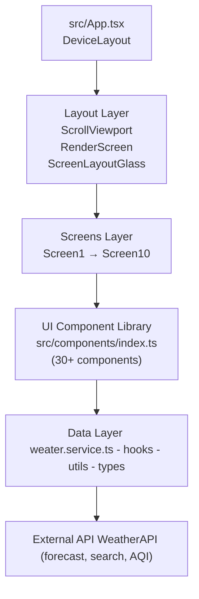

> ## sources:
> 
  &nbsp;
  
  &nbsp;
  
  &nbsp;
  
  &nbsp;

<br>

------------------------------------------------------------------------------------------------------------------------------------------------

<a id="installation"></a>
## 🚀 [INSTALLATION](#-table-of-content)

1. **Clone the repository**:
   ```bash
   git clone https://github.com/ismaelmarot/WeatherApp.git
   cd WeatherApp
   ```
   
2. **Install dependencies using npm**
   ```bash
   npm install
   ```
   
3. **Make sure you have Node.js >= 18 installed (💡Tip)**

   *You can check your version with:*
   ```bash
    node -v
   ```

5. **Setup API Key**
   
    *This project requires a Weather API key to fetch weather data.*

    - Register for a free API key at [WeatherAPI](https://www.weatherapi.com/).  
    - Once you have the key, create a `.env` file in the root folder of the project:
    ```env
    VITE_WEATHER_API_KEY=your_api_key_here
    VITE_WEATHER_BASE_URL=https://api.weatherapi.com/v1
    ```

6. **Run development server**
   ```bash
   npm run dev
   ```

  
6. **This will start the app locally at port 5173.**
    - Make sure your firewall or antivirus is not blocking the development port.
    - ***Open in your browser http://localhost:5173***

   
7. **Troubleshooting**
   
    *If you encounter errors with dependencies, try:*
    ```bash
     rm -rf node_modules package-lock.json
     npm install
   ```
  <br>

------------------------------------------------------------------------------------------------------------------------------------------------

<a id="project-structure"></a>
## 📂 [PROJECT STRUCTURE](#-table-of-content)

*Diagram: Core module dependencies*

```plaintherx
  WEATHERAPP
  src/
  ├── App.tsx                     # Root component → DeviceLayout
  ├── main.tsx                    # ReactDOM entry
  ├── pages/
  │   └── Home/
  │       ├── Home.tsx            # WeatherProvider + ScreenRouter
  │       └── Home.style.tsx      # Container (scroll-snap), AlertError
  ├── layouts/                    # DeviceLayout, ScrollViewport, RenderScreens
  ├── screens/
  │   ├── ScreenRouter/           # Selects and renders active screen
  │   └── Screen1/ … Screen10/    # Individual weather screens
  ├── context/                    # WeatherProvider, useWeatherContext
  ├── components/                 # UI component library (barrel: index.ts)
  ├── services/
  │   └── weather.service.ts      # API calls (getWeatherByCoords, etc.)
  ├── hooks/                      # useDevice, useGeolocation, useWeather, etc.
  ├── utils/                      # aqi, date, moon, wind, pressure, forecast, weather
  ├── types/                      # TypeScript type definitions (barrel: index.ts)
  ├── constants/                  # BREAKPOINTS, COLORS, SCREENS, SCREENS_MAP, etc.
  ├── mixins/                     # flex(), size() CSS mixins
  ├── config/
  │   └── weatherApi.config.ts    # baseUrl, apiKey, defaultDays
  └── test/
      └── setup.ts                # @testing-library/jest-dom import
```

<br>

------------------------------------------------------------------------------------------------------------------------------------------------

<a id="key-module-relationships"></a>
## 📂 [KEY MODULE RELATIONSHIPS](#-table-of-content)

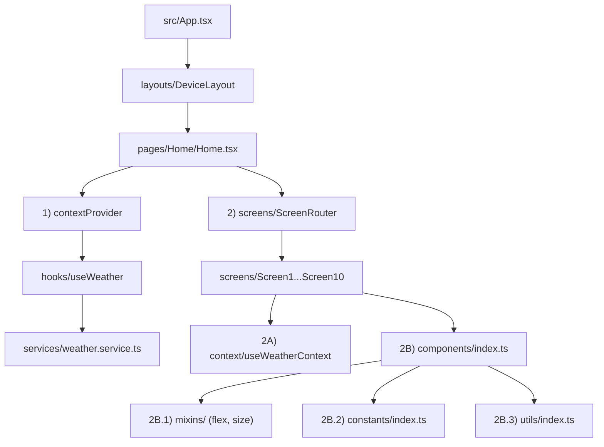

> ## sources:
> 
  &nbsp;
  
  &nbsp;
  
  &nbsp;
  
  &nbsp;
  
  &nbsp;
  
  &nbsp;
  

<br>

------------------------------------------------------------------------------------------------------------------------------------------------

<a id="usage"></a>
## 💡 [USAGE](#-table-of-content)

*After installing dependencies and setting up your API key, you can use the app as follows:*

**1. Import the main layout**

*In your main `App.tsx` file:*
  ```bash
  import 'weather-icons/css/weather-icons.css'
  import { DeviceLayout } from './layouts/DeviceLayout'
  
  function App() {
    return <DeviceLayout />
  }

  export default App
  ```
<br>

**2. Run the app**

*Start the development server if you haven’t already:*
```bash
  npm run dev
```
<br>

------------------------------------------------------------------------------------------------------------------------------------------------

<a id="testing"></a>
## 🧪 [Testing](#-table-of-content)
This project uses **Vitest** for unit testing and **React Testing Library** for component tests.


***1. Install testing dependencies***

If not already installed via `npm install`, run:

```bash
# Using npm
npm install --save-dev vitest @testing-library/react @testing-library/jest-dom

# Or using yarn
yarn add -D vitest @testing-library/react @testing-library/jest-dom
```

***2. Run all tests***

```bash
# Using npm
npm run test

# Or using yarn
yarn test
```

***3. Run in watch mode***
> [!TIP]
> <sub>_By default, this runs all tests once and exit._</sub>

```bash
# Using npm
npm run test:watch

# Or using yarn
yarn test:watch
```

***4. Run a single test file***
```bash
# Using npm
npx vitest run src/components/MyComponent.test.tsx

# Or using yarn
yarn vitest run src/components/MyComponent.test.tsx
```
<br>


------------------------------------------------------------------------------------------------------------------------------------------------
<a id="version"></a>
## [Version](#-table-of-content)

<table style="border-collapse: collapse; width: 100%;">
  <tr>
    <th style="border-bottom: 2px solid #ccc; text-align:left; padding:8px;">Version</th>
    <th style="border-bottom: 2px solid #ccc; text-align:left; padding:8px;">Date</th>
    <th style="border-bottom: 2px solid #ccc; text-align:left; padding:8px;">Changes</th>
  </tr>

  <tr>
    <td style="border-bottom: 1px solid #eee; padding:8px;">1.0.0</td>
    <td style="border-bottom: 1px solid #eee; padding:8px;">26/02/2026</td>
    <td style="border-bottom: 1px solid #eee; padding:8px;">Initial release - Weather general info</td>
  </tr>
</table>


<br>


------------------------------------------------------------------------------------------------------------------------------------------------

<a id="screenshots"></a>
## 📸 [Screenshots](#-table-of-content)

>### 📱 Mobile

<p align="center">
  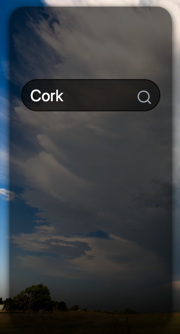
  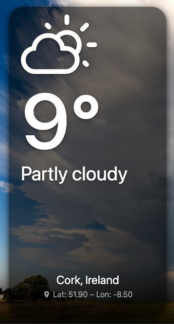
  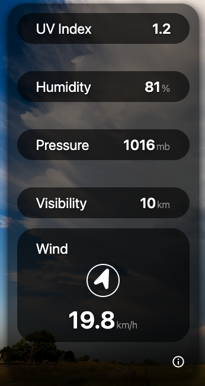
</p>

<details>
<summary><strong>See more...</strong></summary>
<br>
<p align="center">
  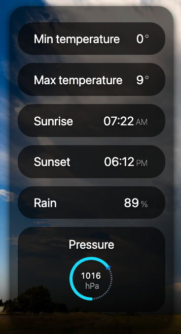
  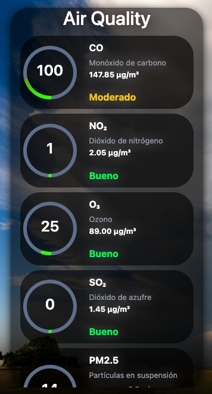
  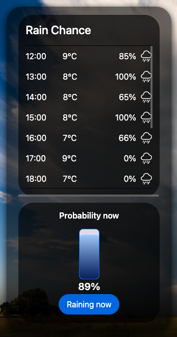
</p>
<p align="center">
  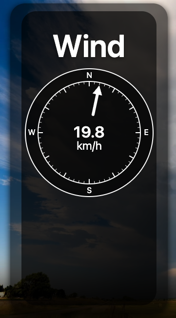
  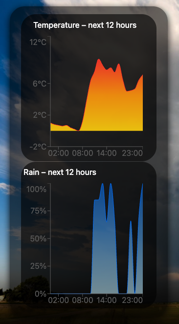
  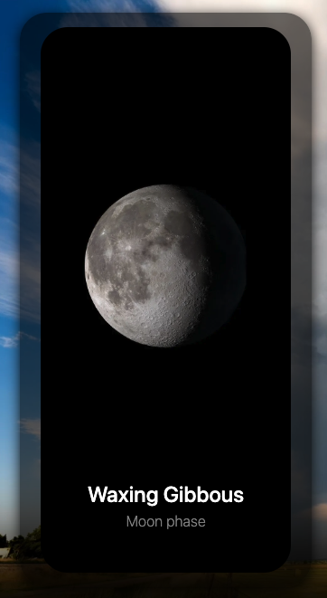
</p>
<p align="center">
  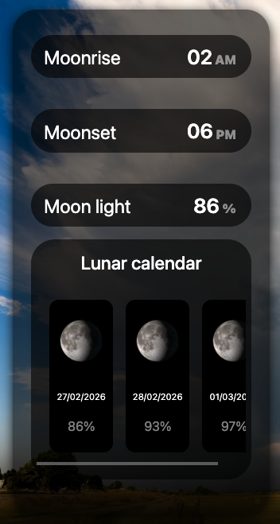
</p>
</details>

<br>

------------------------------------------------------------------------------------------------------------------------------------------------

<a id="live-demo"></a>
## 🌍 [Live Demo](#-table-of-content)

  👉 https://ismaelmarot.github.io/WeatherApp/

<br>

------------------------------------------------------------------------------------------------------------------------------------------------

<a id="license"></a>
## 📄 [License](#-table-of-content)


This project is licensed under the MIT License - see the [LICENSE](LICENSE) file for details.

<br>

------------------------------------------------------------------------------------------------------------------------------------------------

## 📬 Contact

<p align="center">
  <a href="https://ismaelmarot.github.io/" target="_blank">
    
  </a>
  &nbsp;&nbsp;&nbsp;
  <a href="https://www.linkedin.com/in/ismael-marot" target="_blank">
    
  </a>
</p>

------------------------------------------------------------------------------------------------------------------------------------------------

<p align="center">
  <a href="#-table-of-content">
    
  </a>
</p>

<br>
